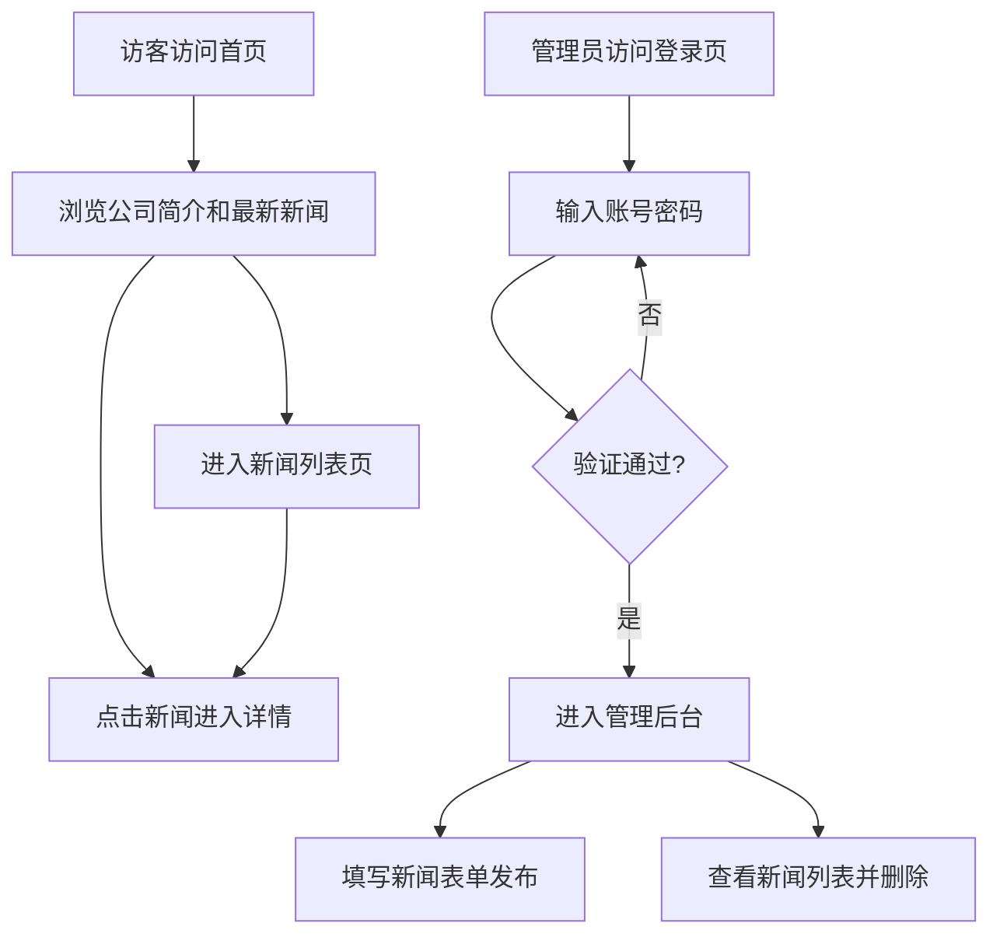

## 1. 产品概述

阿里九九 CMS 是为"阿里九九"科技动画公司打造的官方内容管理系统，包含面向公众的公司展示前台和面向管理员的后台内容管理功能。系统解决公司新闻动态发布、品牌形象展示的需求，目标用户为网站访客和公司内容管理员。

## 2. 核心功能

### 2.1 用户角色

| 角色 | 访问方式 | 核心权限 |
|------|----------|----------|
| 普通访客 | 无需登录 | 浏览公司简介、查看新闻列表和详情 |
| 管理员 | 账号密码登录（admin/admin123） | 发布新闻、删除新闻 |

### 2.2 功能模块

1. **首页**：公司简介展示区域 + 最新3条新闻卡片
2. **新闻列表页**：所有新闻按发布时间倒序排列
3. **新闻详情页**：单条新闻的完整内容展示
4. **管理员登录页**：管理员身份认证
5. **管理后台**：新闻发布表单 + 新闻列表管理（含删除功能）

### 2.3 页面详情

| 页面名称 | 模块名称 | 功能描述 |
|----------|----------|----------|
| 首页 | 公司简介 | 展示公司名称、描述、历史、地址、联系方式等信息 |
| 首页 | 最新新闻 | 展示最新3条新闻卡片，点击跳转详情 |
| 新闻列表 | 新闻列表 | 按发布时间倒序展示所有新闻，支持点击查看详情 |
| 新闻详情 | 新闻内容 | 展示标题、分类、发布时间、正文内容 |
| 管理登录 | 登录表单 | 用户名和密码输入，提交验证 |
| 管理后台 | 新闻发布 | 表单填写标题、分类、内容，提交发布 |
| 管理后台 | 新闻管理 | 展示所有新闻列表，每条新闻支持删除操作 |

## 3. 核心流程

## 4. 用户界面设计

### 4.1 设计风格

- **主色调**：深色背景（#0a0e17），科技蓝强调色（#3b82f6），辅助紫色（#8b5cf6）
- **按钮风格**：圆角（8px），渐变蓝色背景，hover 时发光效果
- **字体**：标题使用思源黑体/Noto Sans SC，正文使用系统等宽字体
- **布局风格**：顶部导航栏 + 内容区居中最大宽度 1200px
- **图标风格**：简洁线性图标

### 4.2 页面设计概览

| 页面名称 | 模块名称 | UI 元素 |
|----------|----------|---------|
| 首页 | 导航栏 | 深色背景，左侧Logo，右侧导航链接（首页、新闻、管理后台） |
| 首页 | Hero区 | 大标题 + 公司简介卡片，渐变蓝色光影背景 |
| 首页 | 新闻卡片 | 3列网格，卡片带悬浮效果，显示标题/分类/时间 |
| 新闻列表 | 新闻列表 | 纵向列表，每条带分割线，显示标题/分类/时间摘要 |
| 新闻详情 | 内容区 | 居中卡片布局，标题/分类标签/时间/正文 |
| 管理登录 | 登录框 | 居中卡片，深色表单，输入框聚焦发光效果 |
| 管理后台 | 发布表单 | 左侧表单（标题/分类/内容输入框），右侧新闻管理列表 |
| 管理后台 | 新闻列表 | 表格形式，操作列含删除按钮（红色警告） |

### 4.3 响应式设计

- 桌面端优先，1200px 最大宽度居中
- 平板端（<768px）：新闻卡片改为2列
- 手机端（<640px）：新闻卡片单列，管理后台上下堆叠布局

## 5. 技术约束

- 前端框架：Vue 3 + Vite
- CSS 框架：Tailwind CSS 3.4+
- 路由：Vue Router 4
- 后端 API：已有 Flask 后端（端口 5000）
- 前端开发服务器端口：5173，通过 Vite proxy 代理到后端
