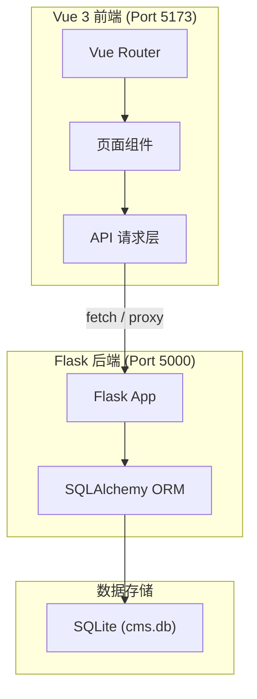
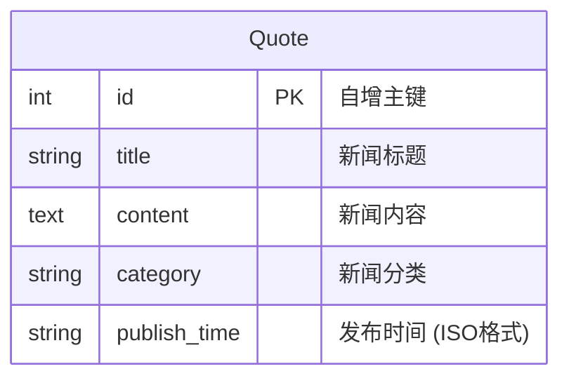

## 1. 架构设计



## 2. 技术选型

- **前端**：Vue 3.4 + Vite 5 + Tailwind CSS 3.4 + Vue Router 4
- **初始化工具**：Vite（`npm create vite@latest`）
- **后端**：Flask 3 + SQLAlchemy（已有，端口 5000）
- **数据库**：SQLite（已有，cms.db）
- **代理配置**：Vite proxy 将 `/api/*` 和 `/admin/*` 转发至 Flask 后端

## 3. 路由定义

| 路由 | 页面 | 组件 |
|------|------|------|
| `/` | 首页（公司简介 + 最新3条新闻） | HomeView |
| `/news` | 新闻列表 | NewsListView |
| `/news/:id` | 新闻详情 | NewsDetailView |
| `/admin/login` | 管理员登录 | AdminLoginView |
| `/admin` | 管理后台（需登录） | AdminDashboardView |

## 4. API 定义

### 前台接口

**GET /** - 获取公司简介和最新新闻
```json
// Response
{
  "code": 200,
  "msg": "获取成功",
  "data": {
    "jianjie": { "name": "...", "description": "...", "history": "...", "address": "...", "email": "...", "phone": "..." },
    "news_list": [{ "id": 1, "title": "...", "content": "...", "category": "...", "publish_time": "..." }]
  }
}
```

**GET /api/news** - 获取所有新闻
```json
// Response
{ "code": 200, "msg": "获取成功", "data": [{ "id": 1, "title": "...", "content": "...", "category": "...", "publish_time": "..." }] }
```

**GET /api/news/:id** - 获取新闻详情
```json
// Response
{ "code": 200, "msg": "获取成功", "data": { "id": 1, "title": "...", "content": "...", "category": "...", "publish_time": "..." } }
```

### 后台接口

**POST /admin/login** - 管理员登录
```json
// Request
{ "username": "admin", "password": "admin123" }
// Response
{ "code": 200, "msg": "登录成功" }
```

**POST /admin/news** - 发布新闻（需登录 Session）
```json
// Request
{ "title": "...", "content": "...", "category": "..." }
// Response
{ "code": 200, "msg": "发布成功", "data": { "id": 1, "title": "...", ... } }
```

**DELETE /admin/news/:id** - 删除新闻（需登录 Session）
```json
// Response
{ "code": 200, "msg": "删除成功" }
```

## 5. 数据模型

### 5.1 ER 图



### 5.2 项目结构

```
project/
├── app_company_cms.py          # Flask 后端
├── cms.db                      # SQLite 数据库
├── frontend/                   # Vue 前端项目
│   ├── index.html
│   ├── vite.config.js
│   ├── package.json
│   ├── tailwind.config.js
│   └── src/
│       ├── main.js
│       ├── App.vue
│       ├── router/index.js
│       ├── api/index.js         # API 请求封装
│       ├── views/
│       │   ├── HomeView.vue
│       │   ├── NewsListView.vue
│       │   ├── NewsDetailView.vue
│       │   ├── AdminLoginView.vue
│       │   └── AdminDashboardView.vue
│       └── components/
│           ├── AppNavbar.vue
│           └── NewsCard.vue
```
